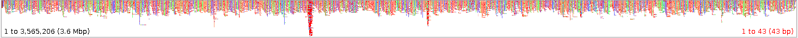
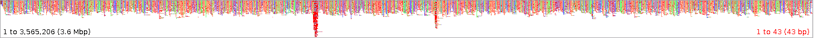
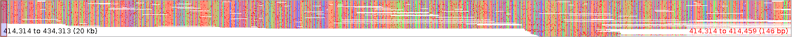
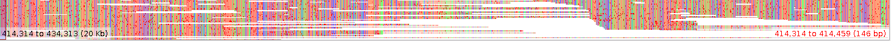
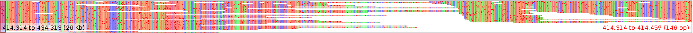

#   A small set of test cases for long-read assembly tools 

## Introduction

A very recent [long-read assembly benchmark](https://github.com/rrwick/Long-read-assembler-comparison) evaluates how robust assemblers are to sequencing artifacts that happen in the reads, using a bacterial genome as a test case. Here we take a different but related standpoint. We provide a set of "supposedly easy" test cases for long-read genome assemblers. Can assemblers *at least* assemble them?

This page is intended 1) to users, in order to give some rough idea of the performance each tool; and 2) to assembly tool developers, in order to highlight situations where they perform sub(optimally.

## Methods

### Test genome

A bacterial genome, 3.5 Mbp, having repeat of length around 16 kbp (according to my own genome-vs-genome alignment). In fact, it is the same genome as in https://github.com/rrwick/Long-read-assembler-comparison/ Quoting Ryan: "not a particularly repeat-rich genome, but it does have four tandem copies of its rRNA operon, which creates a 20 kbp repeat region".

### Assemblers and commands

Exactly the same assemblers, versions and commands as https://github.com/rrwick/Long-read-assembler-comparison/#assemblers-and-commands were used. Command lines are in `scripts/run_assemblers.sh`.

Reads were simulated differently, though. We used (PaSS)[https://bmcbioinformatics.biomedcentral.com/articles/10.1186/s12859-019-2901-7], a recently-published PacBio Sequel read simulator.

### Test cases

Four test cases:

- 50x coverage ("50x" column)

  Here is a visualization of the reads alignment to the reference genome (using the Tablet software).

  

  The high-depth region corresponds to the 16kbp repeat.

- 100x coverage ("100x" column)

  

- 50x coverage with a simulated coverage drop to 10x at a repeat-free location, position 420,000 bp in the reference, ("50x-drop-10x" column)

  from 

  to

  

- 50x coverage with a simulated coverage drop to 5x at the same position as previously  ("50x-drop-5x" column)

  

Raw data is available in the `data/` folder.  Command lines used to generate the reads are in `scripts/generate_reads.sh`.

## Results

| Number of contigs | 50x | 100x | 50x-drop-10x | 50x-drop-5x |
| :-------- | :--------: | :------: |:------: |:------: |
| Canu v1.8 | 1  | 1  | 1 | 2   |
| Flye v2.4.2 | 1  | 1  | 1 | 1   |
| Ra v07364a1 | 2  | 2  | 2  | 3   |
| Unicycler v0.4.7 | 3  | 3  | 3  | 3   |
| Wtdbg2 v2.4 | 2   | 3  | 2  | 2   |

## Caveats 

This is certainly not an extensive benchmark of  assemblers. There is only a single (bacterial) dataset and a single metric (number of contigs). It should be seen as an incentive for tool developers to make sure simple examples are treated correctly.

I am unsure whether I'll keep the last test case (the drop to 5x coverage). It is perhaps a bit too much to ask assemblers to assembly regions that have 5x coverage.

Regarding updates: please submit a pull request if you would like to add/modify an assembler in the table.

## Acknowledgements

This project was largely inspired by R. Wick's and K. Holt's Long read assembler comparison repository: https://github.com/rrwick/Long-read-assembler-comparison/

## License

[GNU General Public License, version 3](https://www.gnu.org/licenses/gpl-3.0.html)

